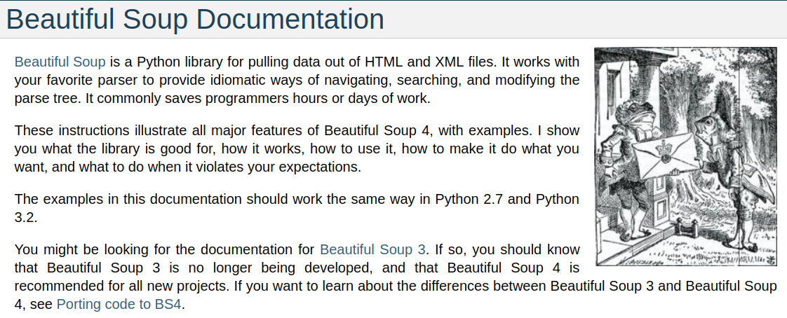

# Application programming interfaces (APIs)
## Prepared for DAT-129 at the Community College of Allegheny County

Code samples for students to reference in creating simple python programs 
which scrape data from websites and display results in user friendly ways. You may explore
[student work samples][idx] on our class work upload index.

## Coding resources
[Python requests module official documentation](http://docs.python-requests.org/en/master/)

## Uses for web scraping
1. Learning the ins and outs of HTML
1. Extracting data from websites which don't
run a formal data extraction API
1. Exploring tree-based data structures

[idx]: https://docs.google.com/spreadsheets/d/1WBgUljnXUQPBeWACoXI5XirGOgpOKGANNRsm8V9Lzzs/edit?usp=sharing
