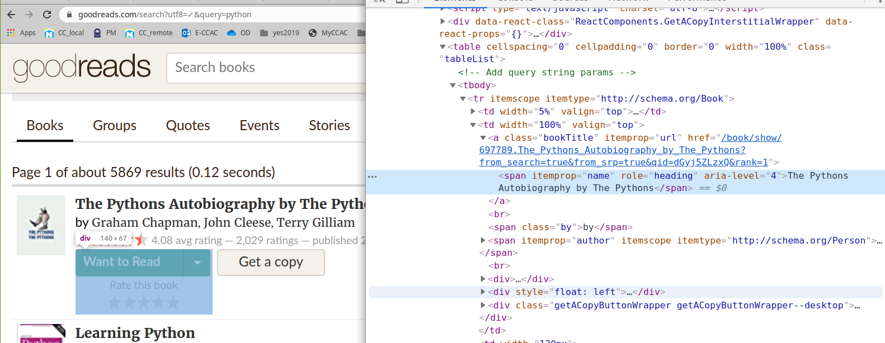

# Screen scraping resources

## Overview
Companion resource hub for DAT-129 taught at the Community College of Allegheny County. Vist the [mini project guide](https://technologyrediscovery.net/python/mod-scraping.html "Project guide on technologyrediscovery.net") for specifications of our course project.

## Contents
*    [testScrape.html](testScrape.html): a simple HTML file for demonstrating basic screen scraping tools
*    [Sapmle scraping script in Jupyter notebook format]: sample script which makes a search request on [goodreads.com](https://www.goodreads.com/) and outputs the titles of books given an inputted keyword

## Scraped HTML from goodreads
This screen shot shows the highlighted `` element containing the text of the book title, whcih our python script scrapes.

