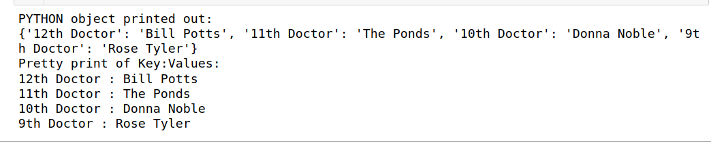

# JSON Processing
[JSON](https://www.json.org/json-en.html) is an data interchange format used widely on The Internet and supported by most programming lanaguges in wide use today.

## Encoding python objects in JSON
We can create a python dictionary and then encode it using JSON and write it to a file:
```
course_films = {}
course_films['Jack Goes Boating'] = 'Java: Might We Be Friends Project'
...
with open('course_films.json', 'w') as film_file:
    film_file.write(json.dumps(course_films))
```

## Decoding JSON files into native Python objects
By reading a file encoded in JSON, we can easily use the json.load() method to rereate native python objects, as seen here:

